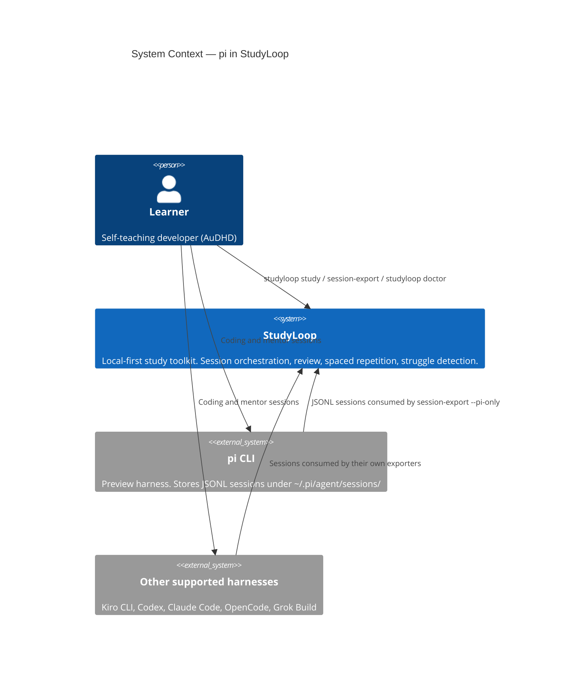
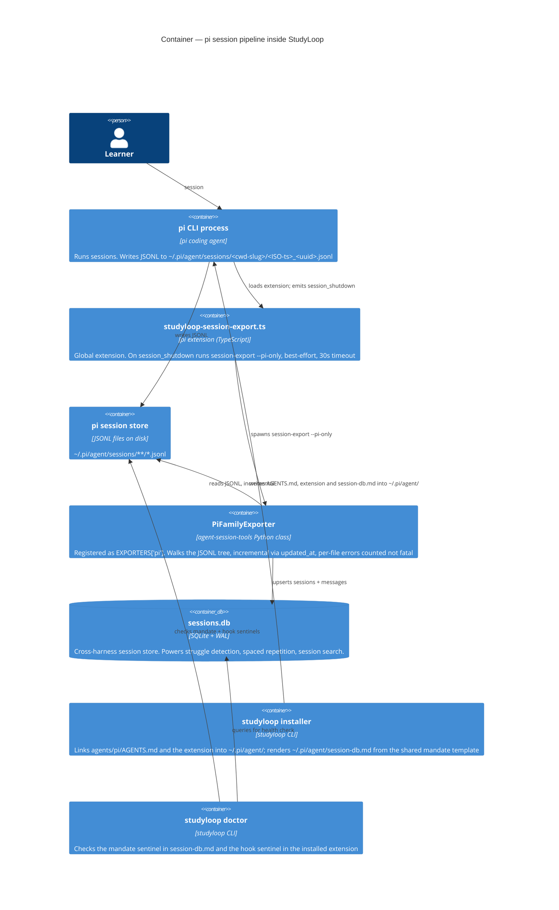
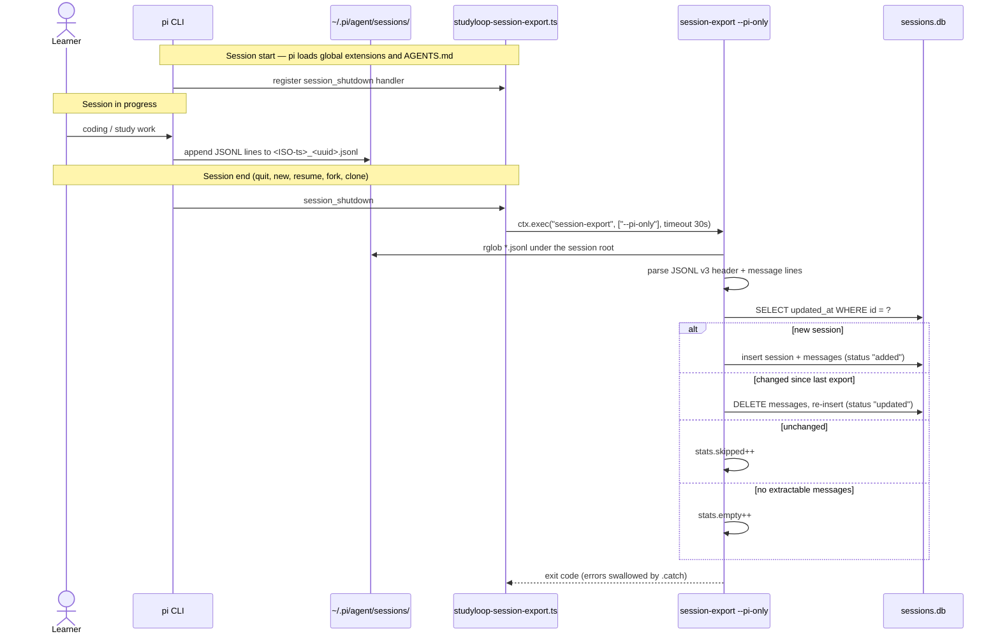

# pi Harness Integration

> Last updated: 2026-09-10. Rewritten from source: every claim below was checked
> against the cited file and line. Where the previous version of this page
> disagreed with the code, the code won — the disagreements are listed in
> [What changed since the previous version](#what-changed-since-the-previous-version).

**TL;DR:** pi is a JSONL-on-disk coding agent and one of StudyLoop's six supported
harnesses (preview tier). Its sessions live as one `.jsonl` file per session under
`~/.pi/agent/sessions/`; `PiFamilyExporter` walks that tree and upserts into
`sessions.db`; the installer links pi's `AGENTS.md` **and** a native
`session_shutdown` extension that runs `session-export --pi-only` at session end,
with the steering mandate in `~/.pi/agent/session-db.md` as the belt-and-braces
second path; `studyloop doctor` checks both.

Supported harnesses are exactly Kiro CLI, Codex, Claude Code (core) and OpenCode,
pi, Grok Build (preview) — `packages/studyloop/src/studyloop/harnesses.py`. No
pi-family fork is a supported harness: there is one pi exporter, one pi installer
target and one `pi` session source, and nothing else in the pi family exists
anywhere in the tree.

---

## What pi Is

| Property | pi |
|---|---|
| Package | `@mariozechner/pi-coding-agent` (the type import used by the shipped extension, `agents/pi/extensions/studyloop-session-export.ts:4`) |
| Data dir | `~/.pi/agent/` |
| Session store | `~/.pi/agent/sessions/<cwd-slug>/<ISO-ts>_<uuid>.jsonl` (`exporters/pi.py:3`, `:45`) |
| Session format | JSONL v3 — one JSON object per line |
| Session-end API | **Yes** — extensions receive `session_shutdown` (`agents/pi/extensions/studyloop-session-export.ts:6-8`) |
| Detection | `shutil.which("pi")` **or** `~/.pi` is a directory (`installers.py:484`) |
| Harness tier | preview (`harnesses.py`: `PREVIEW_HARNESSES = ("opencode", "pi", "grok")`) |
| Session source label | `pi` (`harnesses.py`: `SESSION_SOURCE_BY_HARNESS["pi"] = "pi"`) |

The `<cwd-slug>` directory name encodes the session's working directory with `/`
replaced by `-`, wrapped in a leading and trailing `--` — on this machine
`/Users/ataylor/code/personal/tools/studyloop` is stored as
`--Users-ataylor-code-personal-tools-studyloop--`. **StudyLoop never decodes the
slug.** The exporter reads the real path from the session header's `cwd` field
(`exporters/pi.py:202`, stored as the session row's `project_path`), so a change to
pi's slug encoding cannot break the import.

---

## C4 Level 1 — System Context



---

## C4 Level 2 — Containers



---

## JSONL Format (version 3)

```
Line 1 (session header):
  {"type":"session","version":3,"id":"<uuid>",
   "timestamp":"<ISO8601 with ms+Z>","cwd":"/abs/path"}

Subsequent lines:
  {"type":"message","id":"…","parentId":"…","timestamp":"<ISO>","message":{…}}
  {"type":"model_change",…}
  {"type":"thinking_level_change",…}
```

The nested `message` object (`exporters/pi.py:20-27`):

```
user:       {"role":"user","content":[{"type":"text","text":"…"}],"timestamp":<ms epoch>}
assistant:  {"role":"assistant","content":[…],"model":"…","provider":"…","timestamp":<ms epoch>}
toolResult: {"role":"toolResult","toolCallId":"…","toolName":"…","content":[…],"timestamp":<ms epoch>}
```

Parsing rules, all in `exporters/pi.py`:

- **Roles kept** are exactly `user`, `assistant`, `toolResult`; any other role line
  is skipped (`:228-229`).
- **Text extraction** joins the `text` of `type=="text"` parts with `\n` and skips
  `thinking` and `toolCall` parts; a message that yields no text is dropped
  (`_extract_text`, `:58-78`).
- **Timestamps** prefer the inner message's millisecond epoch, converted to ISO
  (`_ms_to_iso`, `:48-55`); otherwise the outer line's ISO string; otherwise
  `None` (`:235-242`).
- **Header timestamp** is used only when it is already an ISO string; a missing or
  non-string `timestamp` yields `None` (`_header_timestamp`, `:101-109`).
- **Message ids** fall back to `f"{session_id}_{seq}"` when the line has no `id`
  (`:244-247`).
- **Title** is the first 60 characters of the first user message, else the session
  id (`:299`); it is stored in the session row's `metadata` JSON alongside
  `version`.
- A **malformed first line** raises inside `_parse_header` (`:81-98`) and is
  counted in `stats.errors` by the per-file `except` in `export_all` (`:164-165`);
  it never aborts the run.

### Change detection — `updated_at`, not mtime

`updated_at` is the **last message's timestamp**, falling back to the header
timestamp (`:278-279`). The exporter compares that value against the stored
`sessions.updated_at` for the same id (`:282-293`):

- equal → return `"skipped"`, `stats.skipped += 1` (`:160-161`)
- different → delete the session's existing `messages` rows, re-import with
  `status="updated"`
- no existing row → `status="added"`
- no header, no `id`, or no extractable messages → `"empty"`, `stats.empty += 1`
  (`:162-163`)

This matches the opencode exporter's approach (`exporters/pi.py:33-34`) and the
shared results convention in
[CLI Reference § Results & Incremental Behaviour](../cli-reference.md#results-incremental-behaviour).
File `mtime` is **not** consulted anywhere in the module.

### One exporter class, one registered instance

`PiFamilyExporter` (`exporters/pi.py:112`) keeps a parameterised
`(source_name, root)` constructor so tests can point it at an isolated root, but
only one instance is created and registered:

```python
# exporters/pi.py:316
PiExporter = PiFamilyExporter("pi", PI_SESSIONS)

# exporters/__init__.py:25-32
EXPORTERS = {
    "claude": ClaudeCodeExporter(),
    "codex": CodexExporter(),
    "grok": GrokExporter(),
    "kiro": KiroCliExporter(),
    "opencode": OpenCodeExporter(),
    "pi": PiExporter,
}
```

Note `EXPORTERS["pi"]` is an **instance**, not a class, unlike its five peers
which are constructed in place.

---

## Installer Wiring

pi's install targets are two symlinks (`installers.py:84-90`):

```python
"pi": (
    LinkSpec("agents/pi/AGENTS.md", str(_HOME / ".pi/agent/AGENTS.md")),
    LinkSpec(
        "agents/pi/extensions/studyloop-session-export.ts",
        str(_HOME / ".pi/agent/extensions/studyloop-session-export.ts"),
    ),
),
```

and one rendered file (`installers.py:165`):

```python
"pi": _HarnessExport(_HOME / ".pi/agent/session-db.md", "pi-only"),
```

`studyloop install agents --tool pi` therefore does three things:

1. Links `~/.pi/agent/AGENTS.md` → `agents/pi/AGENTS.md` in the repo. That file
   carries the session-memory skill reference and the `session-export --pi-only`
   instruction (`agents/pi/AGENTS.md`, *Session Memory* and *Session Export*).
2. Links `~/.pi/agent/extensions/studyloop-session-export.ts` → the repo's
   extension, which is what makes the export automatic.
3. Renders `~/.pi/agent/session-db.md` from `agents/shared/session-db-mandate.md`,
   substituting `SESSION_EXPORT_FLAG` → `pi-only` (`_render_mandate`,
   `installers.py:193-196`; written by `install_session_db_mandate`, `:199-223`,
   which is idempotent on the `studyloop:session-export-mandate` sentinel).

pi also receives the shared links every harness gets — `agents/shared` →
`~/.agents/shared`, plus the `studyloop-session-memory` and
`studyloop-xtiles-wind-down` skills into the `~/.agents/skills` hub that pi
discovers directly (`installers.py:102-117`).

There is **no `_AGENT_CHOICES` literal**. It is derived:
`_AGENT_CHOICES = RELEASE_HARNESSES` (`installers.py:141`), so the installable set
follows `harnesses.py` and cannot drift from the supported six.

### Launch path — mentor sessions run with extensions off

The pi launch adapter (`packages/studyloop/src/studyloop/adapters/pi.py`) writes
the mentor persona as `AGENTS.md` in the session directory and launches
`pi --no-extensions`, resuming with `pi --no-extensions --continue` (`:24-25`,
locked by `packages/studyloop/tests/test_release_harnesses.py:58-59`).

Consequence worth stating plainly: in a StudyLoop-launched **mentor** session the
installed `session_shutdown` extension does not load, so the export there depends
on the agent following the mandate. The extension covers the learner's **own** pi
sessions, which are the ones StudyLoop does not launch.

---

## Session-End Export

Two independent paths, in order of reliability:

1. **Native extension (automatic).** `agents/pi/extensions/studyloop-session-export.ts`
   registers `pi.on("session_shutdown", …)` and runs
   `ctx.exec("session-export", ["--pi-only"], { timeout: 30_000 })`, catching all
   errors so a failed export can never block pi's exit. Its first line is the
   `// studyloop:session-export-hook` sentinel the doctor keys on.
2. **Steering mandate (agent-driven, best-effort).** `~/.pi/agent/session-db.md`
   plus the *Session Export* section of the installed `AGENTS.md` instruct the
   agent to run `session-export --pi-only` when the learner wraps up.

How that compares across the supported harnesses, as wired in `installers.py`
(`_HARNESS_EXPORT` at `:161-167`, hook paths at `:177-190`) and checked in
`doctor/harness.py:210-243`:

| Harness | Automatic hook | Steering mandate |
|---|---|---|
| Claude Code | `Stop` hook in `~/.claude/settings.json` | `~/.claude/rules/session-db.md` |
| Codex | `~/.codex/hooks.json` | none — the reminder lives in the installed `AGENTS.md` |
| Kiro CLI | `~/.kiro/agents/study-mentor.json` | `~/.kiro/steering/session-db.md` |
| OpenCode | plugin `~/.config/opencode/plugins/studyloop-session-export.js` | `~/.config/opencode/session-db.md` |
| pi | extension `~/.pi/agent/extensions/studyloop-session-export.ts` | `~/.pi/agent/session-db.md` |
| Grok Build (preview) | none today | none today |



---

## CLI Flags

```bash
# Export only pi sessions
session-export --pi-only

# Export pi alongside named other sources
session-export --sources pi kiro

# Export every source that is present
session-export
```

`--pi-only` is declared at `export_sessions.py:366-368`; `pi` is one of the six
values in `SOURCE_CHOICES` (`:163-170`) and one of the six keys in the `only_flags`
map (`:457-464`). The `--*-only` flags are mutually exclusive — more than one
raises `typer.BadParameter` (`:465-467`).

> The `[project.scripts]` entry point targets a thin `main()` wrapper that calls
> `app()`, **not** the `@app.command()`-decorated `export()` function. Pointing the
> entry point at a decorated command object bypasses Typer's argument parser
> entirely — every flag silently falls back to its default. A regression test
> (`TestEntryPointParsesArgv`) guards this wiring.

---

## Doctor Coverage

`check_harness_export()` (`doctor/harness.py:210`) iterates
`installers.detect_available_agent_tools()`. pi is detected when `pi` is on `PATH`
or `~/.pi` exists (`installers.py:484`), and then yields three pi checks:

| Check | Source | Passes when |
|---|---|---|
| `session_memory_skill_pi` | `_session_memory_skill_result`, `doctor/harness.py:98` | `~/.agents/skills/studyloop-session-memory/SKILL.md` exists and contains `name: studyloop-session-memory` |
| `export_mandate_pi` | `_steering_result`, `:29` | `~/.pi/agent/session-db.md` exists and contains `studyloop:session-export-mandate` |
| `session_export_hook_pi` | `_text_hook_result` via the `pi` branch, `:236-243` | the installed extension exists and contains **both** `studyloop:session-export-hook` and `"--pi-only"` |

All three warn rather than fail, and all three are `fix_auto=True`, so
`studyloop doctor --fix` repairs them. No pi special-casing exists outside the one
`elif tool == "pi"` branch — everything else is driven by the dicts in
`installers.py`.

---

## File Map

| Component | File |
|---|---|
| Exporter class + registered instance | `packages/agent-session-tools/src/agent_session_tools/exporters/pi.py` |
| Exporter registry | `packages/agent-session-tools/src/agent_session_tools/exporters/__init__.py` |
| Export CLI (flag + source choices) | `packages/agent-session-tools/src/agent_session_tools/export_sessions.py` |
| Harness contract (tier, label, source name) | `packages/studyloop/src/studyloop/harnesses.py` |
| Installer (links, mandate, detection) | `packages/studyloop/src/studyloop/installers.py` |
| Launch adapter | `packages/studyloop/src/studyloop/adapters/pi.py` |
| Doctor harness checks | `packages/studyloop/src/studyloop/doctor/harness.py` |
| pi AGENTS.md (repo source) | `agents/pi/AGENTS.md` |
| pi session-end extension (repo source) | `agents/pi/extensions/studyloop-session-export.ts` |
| Shared mandate template | `agents/shared/session-db-mandate.md` |
| pi AGENTS.md (installed) | `~/.pi/agent/AGENTS.md` |
| pi extension (installed) | `~/.pi/agent/extensions/studyloop-session-export.ts` |
| pi mandate (installed) | `~/.pi/agent/session-db.md` |

---

## What changed since the previous version

This page previously covered pi plus a pi-family fork that is not a supported
harness (last touched 2026-05-31). Beyond dropping the unsupported half, these
claims in it are contradicted by the code as it stands:

| Old claim | Code |
|---|---|
| "Exit hook API: None" / "pi does not expose an extension API equivalent to Claude Code's `Stop` hook" | pi has an extension API and StudyLoop ships an extension using it — `agents/pi/extensions/studyloop-session-export.ts` on `session_shutdown` |
| Incremental detection uses the file's on-disk `mtime` | `updated_at` comparison only (last message timestamp, else header) — `exporters/pi.py:278-293`; `mtime` appears nowhere in the module |
| A missing header timestamp falls back to "first message timestamp, then file `mtime`, then `None`" | `_header_timestamp` returns `None`; `created_at`/`updated_at` fall back to the first/last **message** timestamp. No `mtime` fallback exists |
| `PiFamilyExporter` is "instantiated twice", once per pi-family source name | one instance, `PiExporter = PiFamilyExporter("pi", PI_SESSIONS)` (`exporters/pi.py:316`), registered as `EXPORTERS["pi"]` |
| `_AGENT_CHOICES` is a hard-coded nine-name literal | `_AGENT_CHOICES = RELEASE_HARNESSES` (`installers.py:141`) — derived, six values |
| Detection is "directory presence: if `~/.pi` exists" | `shutil.which("pi") or (_HOME / ".pi").is_dir()` (`installers.py:484`) |
| The installer creates one symlink (AGENTS.md) | two symlinks — AGENTS.md **and** the session-end extension (`installers.py:84-90`) — plus the shared `~/.agents` links |
| The export path is a steering mandate only, "the same as" two other harnesses (one of them since retired from the harness set) | pi's primary path is its native extension; the mandate is the second path. See the per-harness table above |
| Package name `@earendil-works/pi-coding-agent` | the shipped extension imports types from `@mariozechner/pi-coding-agent` |
| A see-also link to a `docs/troubleshooting/` page for this harness | that file does not exist; the link is removed |

---

## Related Docs

- [Current Architecture](current.md) — full C4 context for all supported harnesses
- [Agent Installation Guide](../agent-install.md) — per-harness install steps
- [CLI Reference](../cli-reference.md) — `session-export` flags
- [Session Memory](../session-memory.md) — what the session DB is used for
