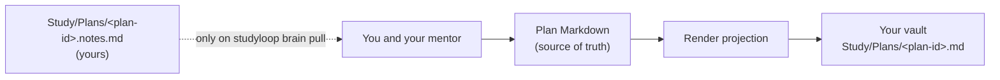

# Second Brain

Most people who study seriously already keep their thinking somewhere: an Obsidian
vault, a visual planner, a notebook. StudyLoop can publish what it knows — your
plan, today's next action, what is due for review — into that place, so you are not
holding two half-pictures in your head.

This is **off by default** and stays completely silent until you choose a provider.
With no `second_brain:` section, StudyLoop imports no code for it, writes no files,
and never mentions it.

## What a second brain means here

StudyLoop publishes **projections**, not a synchronised copy.

Your plan lives as a Markdown document that StudyLoop owns and you can read
(`studyloop plan path`). That document is the **single source of truth**. A
projection is a rendering of it into your second brain — regenerated whenever you
publish, and never read back. Nothing in a backend, the CLI, or an agent protocol
writes to your plan file.



The dashed line is the only path back, it is manual, and it stops at you — not at
the plan file. When you ask for your notes, StudyLoop hands them over; you and your
mentor decide what belongs in the plan and change it with `studyloop plan …`.

The reasoning behind this is recorded in ADR-0010, and the full contract with the
test that proves each clause is in the repository at
`docs/architecture/second-brain.md`.

## Choose one

| Provider | Cost | Where your study text goes | Publishing |
| --- | --- | --- | --- |
| `none` *(default)* | — | nowhere | — |
| `obsidian` | free, local | files in your own vault, on your own disk | `studyloop brain publish` |
| `xtiles` | free plan connects; editing an existing project is paid | your assistant's model service, then xTiles' cloud | your assistant, on request |

Obsidian is the free, local option and it is complete: nothing in StudyLoop needs a
paid service. xTiles is there because some learners already live in it, and it is
served through your assistant rather than by StudyLoop itself.

## What leaves your machine

| Provider | What leaves | To whom |
| --- | --- | --- |
| `none` | nothing | — |
| `obsidian` | nothing. StudyLoop writes files into a folder on your disk. | nobody |
| `xtiles` | the plan text, today's action, due reviews, the session's learning record — only when you run one of the prompts | your assistant's model service, and xTiles' cloud |

Two honest caveats. For Obsidian, "nothing leaves" is a statement about StudyLoop:
if you use Obsidian Sync, or a plugin that phones home, that is your vault's
arrangement and not something StudyLoop can speak for. For xTiles, your sign-in
lives in your assistant's own configuration — StudyLoop stores no credential for
this feature, and there is nothing for it to leak.

## Obsidian

### Where notes go

Everything lives under one folder you name (`Study` by default):

```text
Study/
├── Today.md                                 StudyLoop's, replaced each publish
├── Plans/
│   ├── python-decorators.md                 StudyLoop's, regenerated
│   └── python-decorators.notes.md           yours; StudyLoop only ever reads it
└── Learning Records/
    └── python-decorators/
        └── LR-0001.md                       StudyLoop's, regenerated
```

Get started:

```bash
studyloop brain enable obsidian --vault ~/Obsidian/Personal
studyloop brain publish
```

### The StudyLoop ownership marker

Every note StudyLoop writes carries a marker in its frontmatter:

```yaml
studyloop:
  owned: true
  schema: 1
  kind: plan-projection
  plan_id: python-decorators
  content_hash: 9f2c…
```

That marker is the whole safety mechanism, and it works in the direction that
matters: **StudyLoop never overwrites a note it does not own.** It replaces a file
only when the marker is there and names that same projection. A note you wrote by
hand, a note made from a template, a note whose frontmatter cannot be parsed — all
refused, by name:

```text
Refusing to overwrite 'Study/Plans/python-decorators.md': it is not marked as
StudyLoop-owned. Move or rename that note, then retry.
```

Every write also has to resolve inside the vault you named. An absolute folder, a
`..`, or a symlinked `Study` directory pointing elsewhere is refused before
anything is written.

### Editing or renaming a projection

**Editing** a projection works, but your edit is replaced on the next publish. The
note is a rendering of your plan; there is nowhere in the plan for text you typed
into the vault to live. Put your own thinking in the sibling `.notes.md` instead —
StudyLoop never writes that file.

**Renaming** a projection makes it yours. StudyLoop will not touch a file it cannot
find, and the next publish recreates the canonical one under the original name.

Republishing an unchanged plan does nothing at all: no write, no changed timestamp,
nothing for a sync client to propagate.

### Your own notes, and pulling them back

```bash
studyloop brain pull python-decorators
```

That reads `Study/Plans/python-decorators.notes.md` and prints it. It never creates
that file, never changes it, and reports plainly when there is nothing there yet —
which is a normal state, not an error.

### The template

StudyLoop ships note templates that mirror the plan document's own sections, so a
plan you write by hand in your vault and one StudyLoop published look the same:

```bash
studyloop brain template                       # list them
studyloop brain template --print "Study Plan.md"
studyloop brain template --install             # copy into your templates folder
```

`--install` copies into `<your templates folder>/StudyLoop/` and refuses to
overwrite anything already there. The templates deliberately carry **no** ownership
marker, which is what makes a note you create from one permanently yours.

There is also an optional Dataview query page listing your published plans. It needs
the community Dataview plugin; without it the page is harmless plain text.

### Why there is no Obsidian CLI integration

Obsidian ships an official CLI, and an adapter for it was written for this release
and then withdrawn before it shipped. Two reasons, both found in review:

- It sent notes to whichever vault the running desktop app answered for, and there
  was no way to tie that vault to the one you configured. With more than one vault
  open, a publish could put your plan in the wrong one.
- It passed the whole plan text as a command-line argument, where any other user on
  the machine could read it out of the process table.

Writing files directly is what this feature always needed — the adapter only added
the chance for your own Obsidian template to fire on a note StudyLoop then
overwrote anyway. Nothing here runs an external program, and a test asserts that.

If you had `use_cli`, `vault_name`, `template` or `daily_note` in your config from a
pre-release build, StudyLoop now tells you they are gone rather than ignoring them —
`daily_note` in particular wrote into your own daily note, and you should know it no
longer does.

### Two StudyLoop folders in one vault

If you also use the session-memory export, your vault has two StudyLoop folders and
they are for different things. See [Obsidian Export](obsidian-export.md) for the
comparison.

### Windows and WSL

Notes are written with a temporary file and an atomic rename, which is safe on
Windows too, but a file locked by another program cannot be replaced — StudyLoop
reports that and leaves the existing note intact. Under WSL, point `vault_path` at
the path the vault has *from the side StudyLoop runs on*.

## xTiles

xTiles is a visual planner — projects, pages, tiles, a daily planner — and it is
the one provider StudyLoop does not write to itself. The pattern is two MCP servers
and one assistant: you connect StudyLoop's MCP server and xTiles' hosted connector
to the same assistant, then ask it to move today's study into your planner.
Obsidian remains the free, local option, and nothing in StudyLoop needs xTiles.

### What you need

An xTiles account, an assistant that supports remote MCP servers, and StudyLoop's
MCP server. xTiles states that MCP works on every plan, Free included, with some
limitations there. What its pricing page gates is **editing**, not connecting:
creating projects, pages and tiles is a Free feature, editing an existing project
in a personal space starts at Plus, and editing in a shared space at Pro. That
distinction decides which of the prompts below works for you, so it is named
against each one.

### Set up

One URL, one authorisation:

```bash
claude mcp add --transport http xtiles https://mcp.xtiles.app/mcp
```

Then run `/mcp` inside Claude Code and sign in to xTiles. There is no API key to
copy or store, and xTiles also publishes a connector in Claude's Connectors
Directory if you would rather not add the URL by hand. Tool names appear only
after you have signed in.

This is written for Claude Code, which is where it was tested. StudyLoop installs
the wind-down skill into every harness it detects, but whether Kiro, Codex,
OpenCode or pi can complete xTiles' browser authorisation is not something this
page has verified — the skill stays silent unless an `xtiles` server is actually
connected, so an untested harness costs you nothing.

### What leaves your machine

When you run one of these prompts, the plan text, today's next action, the due
reviews and the session's learning record go to your assistant's model service —
Anthropic, for Claude Code — and through the connector to xTiles' cloud. Nothing
is sent unless you run a prompt. xTiles asks permission per request, and states
that your assistant only gets what your own account can already see and that
nothing is shared with other users. Your sign-in lives in your assistant's own MCP
settings rather than in StudyLoop, and that is also where you end it: remove the
`xtiles` server there.

### Today into your planner

Creates one task, so it works on any plan including Free.

```text
Using the StudyLoop tools, call get_next_action with energy "medium", time_minutes 25 and modality "recall", and get_due_cards with limit 20. Then, in xTiles, add ONE task to today's planner titled "Study: <primary concept>" with the recommendation's reason and estimated minutes in the body, and a checklist of the due reviews, one line per card and at most 20. Do not create a project. Ask me before writing if the planner already has a "Study:" task today.
```

### Your plan as a project

Creating the project works on Free. Refreshing one — editing pages that are
already there — is the paid case: Plus for a personal space, Pro for a shared one.
No MCP tool returns plan Markdown, so paste it in from
`studyloop plan show <plan-id> --markdown`.

```text
Here is my StudyLoop study plan as Markdown, pasted from the CLI. In xTiles, create or refresh a project named "<plan title>" with pages Mission, Milestones, Learning Records, Resources, Checkpoints and Today. Put the Mission text on the home page, the milestones on a Kanban board (done/not done), the learning records as one page each, the resources in a table, and checkpoints as dated tasks. Update existing pages in place; do not delete anything. Tell me what you changed.
```

Name the project exactly, every time. A renamed project is a project this prompt
cannot find, so it creates a second one.

### The wind-down record

Adds a page and a task, so this too works on Free.

```text
We are finishing a study session. Summarise what I covered in three bullets and one insight, then: (1) in xTiles, add that summary as a new learning record page under my "<plan title>" project, titled "LR — <date> — <topic>"; (2) add ONE planner task titled "Review: <concept>" on the next review date from get_due_cards. If we reviewed cards, record each one in StudyLoop with record_study_progress, passing the card_hash that get_due_cards returned. Ask before writing to xTiles; do not repeat the offer if I decline.
```

Your mentor offers this last one for you. `studyloop install agents` installs an
opt-in wind-down skill into every harness it finds, and it stays silent unless
`studyloop brain status --json` reports `provider: xtiles` **and** an `xtiles`
server is connected in that session.

## Commands

```bash
studyloop brain status --json              # provider, whether it can publish, where notes land
studyloop brain enable obsidian --vault ~/Obsidian/Personal
studyloop brain publish                    # today's note plus every active plan
studyloop brain publish --all              # every plan, whatever its status
studyloop brain publish --today --dry-run  # show what would be written, write nothing
studyloop brain publish --plan python-decorators
studyloop brain pull python-decorators
studyloop brain template --install
studyloop brain enable none                # turn it off again
```

`studyloop brain status --json` is what an agent reads. It publishes only when both
`configured` and `supports_publish` are true, which is why a learner on xTiles is
never offered a command that cannot work.

At the end of a session your mentor offers this once, and only when a provider that
can publish is configured:

<!-- wind-down-offer -->
Want me to publish today's study record and this plan to your Obsidian vault (Study/Today.md and Study/Plans/<plan-id>.md)? Yes or no — I'll only ask once.
<!-- /wind-down-offer -->

Say no and it will not ask again.

## Configuration reference

```yaml
second_brain:
  provider: obsidian          # none (default) | obsidian | xtiles
  vault_path: ~/Obsidian/Personal
  folder: Study               # the folder inside the vault StudyLoop owns
  backlinks: true             # [[wikilinks]] to your notes, when the matcher is available
```

Four keys, and that is the whole surface. `STUDYLOOP_SECOND_BRAIN_VAULT` also exists
and overrides the DEFAULT vault location — it is there so the test suite can never
reach a real vault, it never selects a provider, and an explicit `vault_path` always
wins over it. If you have it set in a shell profile, unset it.

`vault_path` is optional: if you already configured a vault for the session-memory
export, or an `obsidian_base`, StudyLoop uses that. Configuring a vault does **not**
switch a provider on — only `provider:` does.

No environment variable selects a provider. Turning this on authorises writes into
your own files, so it has to be a deliberate change to your config.

## Troubleshooting

**Nothing is written and there is no error.** `studyloop brain status`. If
`configured` is `false`, no provider is set.

**"Vault path does not exist or is not writable".** The drive is not mounted, or the
vault moved. Mount it, or `studyloop brain enable obsidian --vault <new path>`.

**"Refusing to overwrite … not marked as StudyLoop-owned".** A note of yours is
already at that path. Move or rename it; StudyLoop will not overwrite it for you.

**My edits to a published note keep disappearing.** They will. Put your own notes in
the sibling `.notes.md`, which StudyLoop only ever reads.

**A note StudyLoop published disappeared from my vault.** Nothing here deletes.
Check whether you renamed it — a renamed projection becomes yours, and the next
publish recreates the canonical one under the original name.

**I deleted a plan and its projection is still there.** Publishing never deletes, so
the note stays until you remove it. That is deliberate: deleting notes is exactly the
class of action this feature will not take without being asked.

**Backlinks are not appearing.** They need the vault topic matcher from
`agent-session-tools`. Without it, publishing continues and logs one warning.

## Sources

Every claim about someone else's software, with the date it was checked.

| Claim | Source | Verified on |
| --- | --- | --- |
| Dataview is a community plugin, not built in | <https://github.com/blacksmithgu/obsidian-dataview> | 2026-09-03 |
| One hosted xTiles MCP server, at <https://mcp.xtiles.app/mcp>; one browser authorisation, no API key to copy or store | <https://help.xtiles.app/en/articles/16126651-how-to-connect-xtiles-to-other-ai-tools> | 2026-09-03 |
| MCP works on every xTiles plan, Free included, with some limitations on Free | <https://help.xtiles.app/en/articles/16126651-how-to-connect-xtiles-to-other-ai-tools> | 2026-09-03 |
| Creating projects, pages and tiles is a Free feature; editing an existing project in a personal space starts at Plus, and editing in a shared space at Pro | <https://xtiles.app/en/pricing/> | 2026-09-03 |
| Your assistant only gets what your xTiles account can already see; nothing is shared with other users; you disconnect by removing the server in your AI tool's own MCP settings | <https://help.xtiles.app/en/articles/16126651-how-to-connect-xtiles-to-other-ai-tools> | 2026-09-03 |
| A remote HTTP MCP server is added with `claude mcp add --transport http`, and `/mcp` manages and authenticates it | <https://code.claude.com/docs/en/mcp> | 2026-09-03 |
| xTiles publishes a connector in Claude's Connectors Directory as a quicker alternative to adding the URL by hand | <https://help.xtiles.app/en/articles/15192396-how-to-connect-xtiles-to-claude> | 2026-09-03 |
