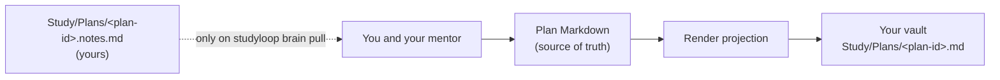

# Second Brain

Most people who study seriously already keep their thinking somewhere: an Obsidian
vault, a visual planner, a notebook. StudyLoop can publish what it knows — your
plan, today's next action, what is due for review — into that place, so you are not
holding two half-pictures in your head.

This is **off by default** and stays completely silent until you choose a provider.
With no `second_brain:` section, StudyLoop imports no code for it, writes no files,
and never mentions it.

## What a second brain means here

StudyLoop publishes **projections**, not a synchronised copy.

Your plan lives as a Markdown document that StudyLoop owns and you can read
(`studyloop plan path`). That document is the **single source of truth**. A
projection is a rendering of it into your second brain — regenerated whenever you
publish, and never read back. Nothing in a backend, the CLI, or an agent protocol
writes to your plan file.



The dashed line is the only path back, it is manual, and it stops at you — not at
the plan file. When you ask for your notes, StudyLoop hands them over; you and your
mentor decide what belongs in the plan and change it with `studyloop plan …`.

The reasoning behind this is recorded in ADR-0010, and the full contract with the
test that proves each clause is in the repository at
`docs/architecture/second-brain.md`.

## Choose one

| Provider | Cost | Where your study text goes | Publishing |
| --- | --- | --- | --- |
| `none` *(default)* | — | nowhere | — |
| `obsidian` | free, local | files in your own vault, on your own disk | `studyloop brain publish` |
| `xtiles` | paid tier | your assistant's model service, then xTiles' cloud | your assistant, on request |

Obsidian is the free, local option and it is complete: nothing in StudyLoop needs a
paid service. xTiles is there because some learners already live in it, and it is
served through your assistant rather than by StudyLoop itself.

## What leaves your machine

| Provider | What leaves | To whom |
| --- | --- | --- |
| `none` | nothing | — |
| `obsidian` | nothing. StudyLoop writes files into a folder on your disk. | nobody |
| `xtiles` | the plan text, today's action, due reviews, the session's learning record — only when you run one of the prompts | your assistant's model service, and xTiles' cloud |

Two honest caveats. For Obsidian, "nothing leaves" is a statement about StudyLoop:
if you use Obsidian Sync, or a plugin that phones home, that is your vault's
arrangement and not something StudyLoop can speak for. For xTiles, your sign-in
lives in your assistant's own configuration — StudyLoop stores no credential for
this feature, and there is nothing for it to leak.

## Obsidian

### Where notes go

Everything lives under one folder you name (`Study` by default):

```text
Study/
├── Today.md                                 StudyLoop's, replaced each publish
├── Plans/
│   ├── python-decorators.md                 StudyLoop's, regenerated
│   └── python-decorators.notes.md           yours; StudyLoop only ever reads it
└── Learning Records/
    └── python-decorators/
        └── LR-0001.md                       StudyLoop's, regenerated
```

Get started:

```bash
studyloop brain enable obsidian --vault ~/Obsidian/Personal
studyloop brain publish
```

### The StudyLoop ownership marker

Every note StudyLoop writes carries a marker in its frontmatter:

```yaml
studyloop:
  owned: true
  schema: 1
  kind: plan-projection
  plan_id: python-decorators
  content_hash: 9f2c…
```

That marker is the whole safety mechanism, and it works in the direction that
matters: **StudyLoop never overwrites a note it does not own.** It replaces a file
only when the marker is there and names that same projection. A note you wrote by
hand, a note made from a template, a note whose frontmatter cannot be parsed — all
refused, by name:

```text
Refusing to overwrite 'Study/Plans/python-decorators.md': it is not marked as
StudyLoop-owned. Move or rename that note, then retry.
```

Every write also has to resolve inside the vault you named. An absolute folder, a
`..`, or a symlinked `Study` directory pointing elsewhere is refused before
anything is written.

### Editing or renaming a projection

**Editing** a projection works, but your edit is replaced on the next publish. The
note is a rendering of your plan; there is nowhere in the plan for text you typed
into the vault to live. Put your own thinking in the sibling `.notes.md` instead —
StudyLoop never writes that file.

**Renaming** a projection makes it yours. StudyLoop will not touch a file it cannot
find, and the next publish recreates the canonical one under the original name.

Republishing an unchanged plan does nothing at all: no write, no changed timestamp,
nothing for a sync client to propagate.

### Your own notes, and pulling them back

```bash
studyloop brain pull python-decorators
```

That reads `Study/Plans/python-decorators.notes.md` and prints it. It never creates
that file, never changes it, and reports plainly when there is nothing there yet —
which is a normal state, not an error.

### The template

StudyLoop ships note templates that mirror the plan document's own sections, so a
plan you write by hand in your vault and one StudyLoop published look the same:

```bash
studyloop brain template                       # list them
studyloop brain template --print "Study Plan.md"
studyloop brain template --install             # copy into your templates folder
```

`--install` copies into `<your templates folder>/StudyLoop/` and refuses to
overwrite anything already there. The templates deliberately carry **no** ownership
marker, which is what makes a note you create from one permanently yours.

There is also an optional Dataview query page listing your published plans. It needs
the community Dataview plugin; without it the page is harmless plain text.

### The optional Obsidian CLI adapter

StudyLoop writes files directly, and that is all it needs. The
[official Obsidian CLI](https://obsidian.md/cli) is an optional extra that adds two
things: your own Obsidian template and plugin hooks fire when a note is first
created, and — if you opt in twice — one link to today's study appears in your daily
note.

It requires the Obsidian **desktop app to be running**, so StudyLoop probes for it
rather than assuming:

```text
obsidian eval '<script>' [vault=<name>]
obsidian create name=<path> [template=<name>] content=<text> [vault=<name>]
obsidian daily:append content=<text> [vault=<name>]
```

`use_cli` has three settings, and the difference between them is what you are told:

| Setting | Behaviour |
| --- | --- |
| `auto` *(default)* | Use the CLI if the binary is installed and Obsidian answers. Otherwise write files, quietly. |
| `on` | Same, but log one warning when it cannot be used — you asked for it, so silence would be wrong. |
| `off` | Never run a subprocess at all. |

Whatever happens, the note gets written. A failed CLI call costs you a template
hook, never a note. `studyloop brain status` and `studyloop doctor` report which
mode is actually in use, not just which one you configured.

If you have several vaults open, set `vault_name`. A probe that answers for a
different vault is treated as a failure — writing your study notes into the wrong
vault is worse than not using the CLI.

### The daily note

`daily_note: true` appends **one line** to today's daily note, at most once a
calendar day, and only when the CLI adapter is actually in use. It is the only
thing StudyLoop writes into a file you own, which is why it needs a second explicit
opt-in and is off by default. The once-a-day record is kept in StudyLoop's state
directory, never in your vault.

### Two StudyLoop folders in one vault

If you also use the session-memory export, your vault has two StudyLoop folders and
they are for different things. See [Obsidian Export](obsidian-export.md) for the
comparison.

### Windows and WSL

Notes are written with a temporary file and an atomic rename, which is safe on
Windows too, but a file locked by another program cannot be replaced — StudyLoop
reports that and leaves the existing note intact. Under WSL, point `vault_path` at
the path the vault has *from the side StudyLoop runs on*.

## xTiles

xTiles guidance lands with the next task in this campaign.

## Commands

```bash
studyloop brain status --json              # provider, whether it can publish, where notes land
studyloop brain enable obsidian --vault ~/Obsidian/Personal
studyloop brain publish                    # today's note plus every active plan
studyloop brain publish --all              # every plan, whatever its status
studyloop brain publish --today --dry-run  # show what would be written, write nothing
studyloop brain publish --plan python-decorators
studyloop brain pull python-decorators
studyloop brain template --install
studyloop brain enable none                # turn it off again
```

`studyloop brain status --json` is what an agent reads. It publishes only when both
`configured` and `supports_publish` are true, which is why a learner on xTiles is
never offered a command that cannot work.

At the end of a session your mentor offers this once, and only when a provider that
can publish is configured:

<!-- wind-down-offer -->
Want me to publish today's study record and this plan to your Obsidian vault (Study/Today.md and Study/Plans/<plan-id>.md)? Yes or no — I'll only ask once.
<!-- /wind-down-offer -->

Say no and it will not ask again.

## Configuration reference

```yaml
second_brain:
  provider: obsidian          # none (default) | obsidian | xtiles
  vault_path: ~/Obsidian/Personal
  folder: Study               # the folder inside the vault StudyLoop owns
  backlinks: true             # [[wikilinks]] to your notes, when the matcher is available
  use_cli: auto               # auto | on | off
  vault_name:                 # for the CLI, when you have several vaults
  template:                   # your own Obsidian template to create notes from
  daily_note: false           # one link line in today's daily note (needs the CLI)
```

`vault_path` is optional: if you already configured a vault for the session-memory
export, or an `obsidian_base`, StudyLoop uses that. Configuring a vault does **not**
switch a provider on — only `provider:` does.

No environment variable selects a provider. Turning this on authorises writes into
your own files, so it has to be a deliberate change to your config.

## Troubleshooting

**Nothing is written and there is no error.** `studyloop brain status`. If
`configured` is `false`, no provider is set.

**"Vault path does not exist or is not writable".** The drive is not mounted, or the
vault moved. Mount it, or `studyloop brain enable obsidian --vault <new path>`.

**"Refusing to overwrite … not marked as StudyLoop-owned".** A note of yours is
already at that path. Move or rename it; StudyLoop will not overwrite it for you.

**My edits to a published note keep disappearing.** They will. Put your own notes in
the sibling `.notes.md`, which StudyLoop only ever reads.

**The Obsidian CLI is installed but not being used.** The desktop app has to be
running, and — if you set `vault_name` — the right vault has to be the one that
answers. `studyloop doctor` reports what it found.

**Backlinks are not appearing.** They need the vault topic matcher from
`agent-session-tools`. Without it, publishing continues and logs one warning.

## Sources

Every claim about someone else's software, with the date it was checked.

| Claim | Source | Verified on |
| --- | --- | --- |
| An official Obsidian CLI exists; it drives a running desktop app | <https://obsidian.md/cli> | 2026-09-03 |
| Dataview is a community plugin, not built in | <https://github.com/blacksmithgu/obsidian-dataview> | 2026-09-03 |
