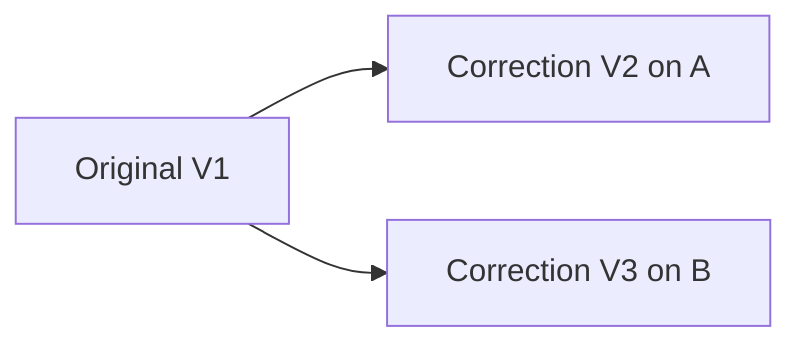

# Studying evidence, databases and shared memory

This is a living explanation of the experiment, not a claim that we have chosen
the final SessionWeave database. Read the decisions alongside their tests. A
useful design decision records the problem, the alternative, the trade-off and
the evidence that would make us change our mind.

## 1. Begin with behaviour, then choose storage

The question is: can an agent recover a relevant past decision, distinguish a
proposal from a verified result, notice a correction, and respect forgetting?
A database engine supplies mechanisms. It does not decide what counts as a
verified claim or whether a personal machine should receive work conversations.
Those are domain rules, and we must specify them whichever engine wins.

There are three separate choices:

| Choice | Example in this lab | What it answers |
|---|---|---|
| Data model | Sources, immutable versions, correction parents, deletion markers | What does the information mean? |
| Retrieval method | Keyword matching, then reviewed relationship traversal | How do we find useful evidence? |
| Storage engine | SQLite for the initial experiment | How do we store and query the model reliably? |

A graph-shaped model does not require a graph server. Conversely, moving records
into a graph engine does not discover accurate relationships for us. Keeping
these choices separate lets us compare retrieval without accidentally comparing
different extraction quality, corpora and operating infrastructure at once.

## 2. Decision: SQLite for the lifecycle baseline

**Problem:** several related changes must succeed or fail together. Forgetting
needs to record a deletion marker, remove versions, remove searchable text and
invalidate derived content. An interrupted half-deletion is dangerous.

**Choice:** one SQLite transaction over ordinary tables and FTS5. SQLite's atomic
commit property supplies the all-or-nothing boundary. Our application still has
to put the correct operations inside it.

**Why this over separate stores now?** A second vector or graph service would
create another consistency boundary. We would need durable invalidation jobs,
retry behaviour and a way to stop serving stale results while that service is
behind. That may eventually be worthwhile, but adds an untested variable to this
first lifecycle experiment. SQLite lets us inspect actual rows and exercise the
failure cases using temporary files without deploying services.

**Trade-off:** this is not proof that SQLite has sufficient throughput for every
workload. We have not benchmarked multiple engines. The transfer format currently
ships complete scoped snapshots; that will be inefficient at scale. Reconsider
storage/transport after measuring representative sizes, write contention,
traversal workloads, rebuild cost and required sharing model.

Reference: [SQLite atomic commit](https://www.sqlite.org/atomiccommit.html).
The documentation explains all-or-nothing transactions and the storage assumptions
behind them. Our process-exit test is evidence for one application interruption
point, not a power-loss certification across hardware and filesystems.

## 3. Read the lifecycle schema

Open [lifecycle.py](lifecycle.py), then [the tests](tests/test_lifecycle.py).

| Table | Purpose | Why separate? |
|---|---|---|
| sources | Stable logical identity and explicit scope | Identity survives changes to wording. Scope cannot come from the harness name. |
| versions | Immutable content, availability, correction parent and reason | Keeps the explanation of how a decision changed. |
| tombstones | Identities that must remain forgotten | An absent row alone cannot distinguish deletion from never having received it. |
| search | FTS index of remaining version text | A rebuildable way to find words, not an independent source of truth. |
| artifacts | Managed derived summaries, edge payloads and context caches | Derived text can retain information even after the original disappears. |
| dependencies | All source identities used by each artifact | Enables conservative invalidation when any contributing source changes. |

The artifact table stores synthetic payloads tagged by kind. It does not implement
a summary generator, vector index or the earlier evidence-store graph. Testing
this dependency mechanism is not equivalent to validating every future adapter.

Source IDs are caller-supplied in this lab. Production adapters must agree on
stable identity across machines, imports and aliases. A new ID for the same
forgotten conversation can evade suppression: solving identity is a prerequisite,
not something a tombstone magically solves. Synthetic names are used for clarity;
production identifiers should not embed transcript text or sensitive paths.

## 4. Decision: correction parents over last-writer-wins

Imagine both laptops have version V1. Offline, A creates V2 and B creates V3.
Both identify V1 as the version they correct:



**Choice:** current versions are visible versions that have no visible child.
After exchange, V2 and V3 are both current heads. The application should display a
conflict instead of quietly promoting one to truth. Timestamp ordering is used
for historical visibility; parent references express supersession.

**Alternative:** last-writer-wins chooses the latest timestamp. This is simple,
but machine clock differences and independent edits can hide legitimate evidence.
A later timestamp does not prove a stronger argument. We preserve ambiguity
because the intended consumer is an agent that needs to reason about decisions.

**Cost:** multiple heads need a clear presentation and an explicit resolution
workflow. This lab has one parent per version; joining multiple conflicting
parents into a resolution is not implemented. Nor does a correction reason prove
its factual validity. Integrating exact supporting citations/validation artifacts
with the earlier evidence store remains a separate gate.

**Historical queries:** as-of V1's availability return V1; after V2 arrives the
current head is V2. Replaying the old V1 does not make it current again. Availability
is explicit caller input in this lab, not trustworthy capture telemetry. The
original evidence prototype separately tests source-event and availability times.

## 5. Decision: deletion wins, with a permanent marker

Suppose A deletes a conversation while B is offline. If A merely removes its row,
B can later upload its old copy. A cannot distinguish that copy from new data.

**Choice:** retain the source identity in a grow-only tombstone set and delete its
content. On receive, apply tombstones first. Every later import checks the set;
a matching source is suppressed. Both transfer orders and repeated delivery must
converge to the same state.

**Why not compare deletion and edit timestamps?** This experiment chooses a clear
privacy rule: deletion wins even over an offline correction. Clock order does not
undo it. Restoring or reauthorizing a deleted identity is deliberately unsupported.
That is a product trade-off to review, not a universally correct policy.

**Cost:** deletion metadata persists. Safely removing it would require knowing
that no offline replica, backup or importer can replay the old source, or defining
an explicit retirement/epoch protocol. A time-based expiry alone is unsafe under
unbounded offline duration. This prototype therefore has no tombstone expiry.

Deletion also overrides historical lookup: asking for an earlier date does not
restore forgotten content. Correction and forgetting serve different purposes.

## 6. Decision: invalidate derived content by dependency

A summary can quote two sources. Forgetting either source means we cannot assume
that deleting one sentence from the summary is enough. An embedding or inferred
relationship can also retain information derived from the forgotten source.

**Choice:** every managed artifact declares all source dependencies. Correcting
or forgetting any dependency removes the whole artifact; unrelated artifacts
survive. Search is rebuilt from remaining source versions only.

**Alternative:** surgically update each derived object. This may save regeneration
work but requires trustworthy fine-grained attribution. We start with conservative
invalidation because a stale recommendation is harder to notice than a missing
summary that can be regenerated.

**Limit:** the dependency declarations must be complete. We reject empty ones,
but cannot infer whether a producer omitted a dependency. The lab handles direct
source dependencies; future multi-stage derivations must carry transitive source
lineage or implement recursive invalidation. No real vector index is enabled, so
vector forgetting is NOT TESTED.

Reference: [SQLite FTS5](https://www.sqlite.org/fts5.html) describes the text index.
Our rebuild test demonstrates application-level removal from this enabled index.

## 7. Logical forgetting is not physical erasure

The tests establish absence through supported lookups, search, exports and
managed artifact rows. They do not inspect every byte of disk, journals, backups
or OS caches. SQLite documents additional caveats for secure deletion and virtual
table shadow storage: [secure_delete](https://www.sqlite.org/pragma.html#pragma_secure_delete).

A production restore must apply current deletion markers before serving a backup.
Original harness transcripts, copied exports and previously returned context packs
are outside a DB-only purge. The demo's report intentionally contains synthetic
before/after text for learning; it is not a managed cache. Never use real private
content with this teaching demo and claim the report was erased.

## 8. Scope at the transfer boundary

Filtering search results is too late if a work transcript has already been sent
to a personal-only machine. This lab filters before serialization and independently
checks the receiver's allowed scopes. A disallowed transfer is rejected atomically.

**Why both sides?** Sender filtering prevents unnecessary disclosure; receiver
validation protects against a misconfigured sender. This is a trusted local lab,
not authentication or authorization for hostile network clients. Transfers are
JSON strings between actual databases, not the production SSH/session-sync path.

Scope is immutable here. Reclassification raises an error instead of risking old
copies being stranded on previously authorized machines. Supporting reclassification
requires a revocation/deletion protocol with explicit policy for prior replicas.
That remains an outstanding part of requirement B2.

## 9. Run, predict, inspect

From the experimental worktree:

```sh
uv run python -m experiments.evidence_context.lifecycle_demo --output /tmp/sessionweave-lifecycle-study
uv run --group dev pytest experiments/evidence_context/tests/test_lifecycle.py -q
```

Use a new output directory each run. Inspect summary.json plus a.db and b.db.
Before running, predict which version the early query returns and whether an old
transfer can restore text after forgetting. Compare your prediction with the
report and the database tables.

The 12 lifecycle test cases cover correction history, competing heads, both sync
orders, duplicate replay, import after deletion, index rebuild, derived invalidation,
transfer scoping, invalid correction, fixed scope, and transaction interruption.
The interruption case launches a real process and exits after tombstone insertion
but before purge. Rollback leaves the previous coherent state; a subsequent retry
commits deletion. No mock sync function supplies the expected outcome.

A useful optional exercise is to write a 5–10 line display function on your own
branch: given heads(), return 'no evidence', 'one current report', or 'conflicting
reports', with the relevant version IDs. Consider why choosing the longest text
or newest clock value would be a decision policy rather than a harmless display
choice. No placeholder blocks the working experiment.

## 10. What this means for the database decision

So far SQLite can express and pass these small lifecycle scenarios. We have not
shown that it is the fastest engine, or that relationship retrieval improves
answers. The results support retaining it as the reference implementation while
we finish integration contracts and held-out retrieval evaluation.

The next unresolved questions are source identity across real adapters, correction
citations, reclassification, restored backups, real derived-store invalidation,
capture health and installed-package ownership. Those are documented gaps. Health
and installation require their own evidence; a passing deletion test cannot stand
in for a successful StudyLoop installation.

For StudyLoop, the intended boundary remains: the memory component owns capture,
source lifecycle, migrations and sync; StudyLoop owns learning state and teaching.
Use one setup/doctor contract rather than two independently maintained installers.
We have not created SessionWeave or changed either product's installed hooks.
