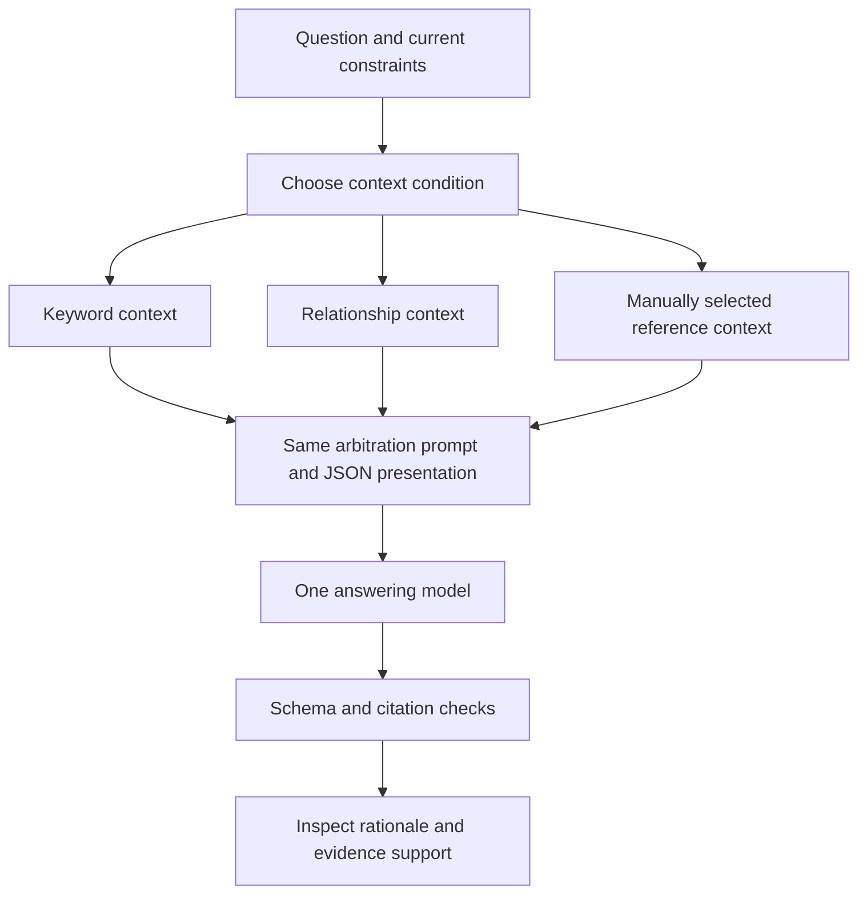

# Stage 6: inspecting conflict arbitration

## What we built

A runnable synthetic arbitration lab with four cases, three context conditions,
two explicit prompt versions and preserved actual model responses. It builds
contexts using the earlier SQLite retriever and calls one answering model. It does
not implement an automatic truth engine or make a database recommendation.

The most interesting result is a failure: supplying both unsupported queue-speed
claims made the model prefer the later one. It invented supersession while admitting
there were no benchmarks. A more explicit prompt did not fix that observed failure.

## Explore without paying for another run

Read [RESULTS.md](RESULTS.md), then [v1 answers](observations/v1.md) and
[v2 answers](observations/v2.md). These are preserved synthetic provider outputs,
not deterministic fixtures or independently graded gold answers. Published observations
use consistent SourceNN aliases for evidence IDs and omit hash values; wording is
otherwise unchanged. Exact originals remain in the private run artifacts. New
runs produce their own complete frozen manifests.

From the experimental worktree root:

```sh
uv run python -m experiments.evidence_context.arbitration_lab --output /tmp/evidence-stage-6-v1
uv run python -m experiments.evidence_context.arbitration_lab --prompt-version v2 --output /tmp/evidence-stage-6-v2
uv run --group dev pytest experiments/evidence_context/tests/test_arbitration_lab.py -q
```

Default mode makes NO model calls. It creates frozen.json, prompt.md,
blind-review-input.json and an isolated synthetic.db. Use new output directories.
Compare the two prompt.md files and their identical user-message contexts.

For an explicit live rerun, configure LITELLM_API_KEY in the process environment,
with LITELLM_BASE_URL pointing to a loopback HTTP gateway (default port 4000), then:

```sh
uv run python -m experiments.evidence_context.arbitration_lab --prompt-version v2 --model qwen3-coder --live --output /tmp/evidence-stage-6-live
```

This makes 12 provider requests, two concurrent, with a 90-second timeout per call
and no automatic retry. Output token maximum is 1500 per call. Live runs cost money
and may differ from the preserved observations. Missing keys or provider failures
are recorded as failures, not fabricated answers. Credentials never enter frozen
inputs or reports. The runner has no dependency on the private council launcher.

## How the arbitration actually works



There are three different kinds of logic here:

1. Retrieval is code: it selects eligible passages. In this toy corpus keyword
   finds the original report; the other conditions include the later evidence.
2. Arbitration is model behaviour steered by a prompt: compare conditions and
   evidence quality, then give an auditable rationale or retain uncertainty.
3. Mechanical checking is code: validate JSON categories and cited IDs, and flag
   artifact-supported answers lacking a cited artifact. It cannot establish that
   the cited text logically supports the claim.

This separation matters. All cited IDs can exist and the conclusion can still be
wrong. The queue result demonstrates exactly that. A structured JSON answer makes
inspection easier; it does not make the content true.

## Read the prompt as a decision procedure

[PROMPT-v1.md](PROMPT-v1.md) asks the model to compare assumptions, distinguish
reports from artifacts, avoid recency/majority/confidence shortcuts, explain the
link between evidence and conclusion and preserve uncertainty. It asks for a
short inspectable rationale, not a private internal reasoning transcript.

The response schema separates recommendation, conflict_kind, evidence_basis,
rationale, alternative, citations, uncertainty and next_check. Separating fields
lets us notice that "recommend B" and "no supporting measurements" can coexist
in a response. The model is not forced to reconcile them correctly by the schema.

[PROMPT-v2.md](PROMPT-v2.md) keeps the original rules and adds explicit decision
checks: later opinion is not supersession; same-condition unmeasured performance
claims should remain unresolved; uncertain changed-condition recommendations
should be conditional; insufficient answers should still cite the available
reports. PROMPT.md preserves the original text for continuity.

We changed ONLY the system steer between live rounds. The cases, reference
selections, expected labels, context rendering, model, temperature, request order
and output limit stayed fixed. We did not rewrite the evidence to force success.
The second run is development feedback on already seen cases, not a held-out test.

## What the context conditions isolate

| Condition | Purpose |
|---|---|
| Keyword | Existing FTS baseline: is crucial evidence missed? |
| Relationships | Does manually curated connectivity recover the missing context? |
| Reference | What does the model do when given all the fixture's intended evidence? |

For this tiny engineered corpus, relationship and reference messages are byte-for-byte
identical in all four cases (verified from both frozen runs). Thus there are eight
distinct inputs per prompt, not twelve. Their outcomes are not independent
corroboration of different retrieval methods. The reference
pack was selected by the case author, not an external expert. It is a diagnostic
reference, not gold proof of completeness.

Contexts use the same 8000-byte ceiling for question/constraints/evidence and the
same presentation. We record actual gateway token usage, but do NOT enforce a
matched model-token input budget. This is a disclosed deviation from the ideal
answer-evaluation protocol, acceptable for a small synthetic development pilot,
not a basis for token-efficiency or comparative efficacy claims.

## Where the evidence comes from

All cases are authored synthetic scenarios. test_artifact is a fixture-assigned
kind describing a hypothetical check, revision, environment and result. We did
not run those retry/reopen checks against a real product. The model's use of the
artifact demonstrates behaviour under that assumption, not real validation.

A production system cannot trust an arbitrary transcript saying "test_artifact".
It needs provenance from an actual capture/tool-output path and checks of identity,
revision, applicability and result. That ingestion is not implemented here.

The selected contexts expose opaque IDs and types, never the arm name or expected
answer labels. The corpus uses synthetic reviewed links to assemble candidate
conflicts; these are not automatically extracted relationships.

## Reading the tests and observed results

The 11 new tests check balanced preparation, stable context across prompt versions,
no answer-label leakage, invalid schemas, unknown citations, coarse artifact gates,
output preservation and budget refusal. The full suite has 124 tests. They do not
assert that a live model will follow the prompt or reason correctly.

Expected category matches are diagnostics. They are not a validated answer-quality
score: "correction" versus "unequal evidence" overlaps without careful definitions;
"B" with a caveat versus "conditional" may reflect schema ambiguity. Read the
rationale and source support before interpreting a mismatch as a bad answer.

Blind-review files are supplied for later independent grading. In this run the
coordinator read labelled answers; no independent blind grading was performed.
The explanation rubric and actual learner feedback remain necessary for a claim
about learning usefulness.

## An exercise worth trying

Read the queue/reference v1 answer before reading the v2 prompt. Underline the
claim that the later report "explicitly corrects" the earlier one. Now inspect
cases.json: where is the explicit correction or measurement? This is why valid
citations and an uncertainty paragraph are insufficient assurance.

Then compare retry/keyword with retry/reference. Here the missing artifact explains
the change from insufficient evidence to a supported fixture conclusion. That is a
retrieval effect; the queue failure with complete context is an arbitration effect.

We stop after one prompt revision. Continuing until these four examples pass would
risk overfitting. The council record explains the next bounded experiment.
