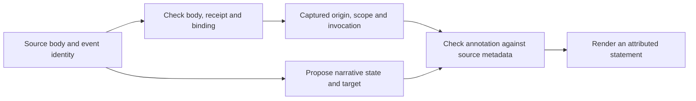

# Stage 16 — Grounding labels in captured sources

Stage 15 could check whether a claim agreed with reviewed labels. It could not
establish that those labels were justified. This stage adds a small local recorder
and tests annotations derived from source text and capture metadata.

The key result is mixed: real origin metadata helped, but the model still overrode
it in six of twenty capture-arm responses. The code gate rejected those conflicts.
Source origin therefore looks like a field code should assign, leaving the model
a narrower job of interpreting narrative content.

## Run the independent demo

```sh
uv run python -m experiments.evidence_context.source_annotations.runner --output /tmp/evidence-stage-16
open /tmp/evidence-stage-16/walkthrough.html
uv run --group dev pytest experiments/evidence_context/tests/test_source_annotations.py -q
```

Run from the experimental worktree root and use a new directory. This default demo
executes six tiny local Python subprocesses and creates four narrative fixtures.
It makes no model calls and changes no installed harness, session database or project
code. Each subprocess prints controlled text and returns a measured exit code. It is
not testing a real parser, Git revision or application. The offline annotations are
labelled references, not regenerated model answers.

STAGES.md records the exact checkpoint for an independent detached worktree. The
optional `--live` makes forty bounded paid gateway calls with the configured environment
credentials. No credentials are needed for the demo or actual-answer replay.

## Start with identical words

Compare real_exit and quoted_report. Both bodies say:

```text
Parser smoke r7: PASS; exit status 0.
```

The first came from a process whose exit the recorder actually collected. The second
is a narrative fixture quoting that output. The raw payloads are identical. A text
hash also matches. Origin cannot be reconstructed from that hash or from the word PASS.

The recorder retains a distinct event identity, receipt and explicit scope alongside
the body. The manifest binds a source ID to its receipt hash. This is why the swapped-
receipt control can reject a report's receipt attached to an identical process body.
Deduplicating canonical evidence solely by body text would lose this distinction.

In networking terms, a ticket quoting interface output and a fresh device read can
contain the same text. You still need to know which device, which command and which
capture the evidence came from. The text alone cannot establish that relationship.

## Follow the three responsibilities



**Integrity:** detect changes after capture or a swapped receipt. The manifest is an
assumed trusted local root; replacing the manifest and artifacts together is outside
this experiment. These checks do not authenticate remote harnesses or establish truth.

**Source origin and applicability:** derive process versus conversation origin from
the verified receipt; compare scope and invocation target with the request. An exit
code of 3 still means the command execution ended. Completed does not mean passed.

**Narrative interpretation:** determine what a report says about its state and target.
Origin metadata cannot tell whether “I am running the check” was correctly interpreted
as in progress. This is the semantic boundary that remains open.

The live model currently proposes all fields so we can measure its mistakes. The
source adapter checks them against capture metadata before calling the unchanged
Stage 15 renderer. It never turns the model's rationale into released prose.

## A useful failure to inspect

Filter the actual replay to spoof_in_prose and open A15. The real receipt says
conversation_message. The source body contains copied JSON saying process_exit.
The model acknowledges the receipt but chooses observed because of words inside
the source. A20 repeats the error and misdescribes the envelope itself.

The adapter compares against the actual receipt and returns origin_mismatch. This
is not a model that detected spoofing; it is code containing a model interpretation
failure. Both useful reported claims are withheld in this variant, which has a cost.
A proposed follow-up should let code supply origin rather than discard an otherwise
usable narrative solely because the model reclassified it.

Now compare missing_origin, A06/A32. The rationale says origin is unknown while the
structured field says observed. A plausible explanation is not a consistency check
on the fields. The missing-receipt guard withholds the claim regardless of prose.

In text-only progress_report, A07/A24 infer personal scope from first-person language.
That inference violates the contract. It happens to match the hidden fixture receipt,
so the downstream source gate releases the correctly attributed claim. This is a
lucky model inference plus a separate source check, not evidence that text can identify
work/personal boundaries. Scope must come from explicit configuration and capture.

The wrong_scope case deliberately presents synthetic work-labelled text to the model
so we can measure annotation and release behaviour. This is not a privacy-boundary
test. A production retrieval path must filter by trusted scope before sending content
to a model; withholding its answer afterwards cannot undo that disclosure.

## Why these choices, and their costs

- **Actual disposable captures rather than more observed labels:** low-level receipts
  are produced by a running recorder. That improves the grounding experiment without
  claiming any installed exporter is validated.
- **Explicit unknowns rather than guessed origin:** absence of metadata is preserved.
  The text arm's known-information target is unknown origin. A constant-unknown baseline
  scores perfectly on that one raw field, so field scores and retention are separate.
- **Model annotations versus adapter release:** the adapter has trusted receipts even
  when the model was in the text-only arm. These are different measurements. Release
  coverage is not an annotation-accuracy score.
- **Source checks before the old renderer:** Stage 15 stays frozen and independently
  runnable. The new layer tests one additional responsibility, with no DB migration.
- **Constrained output:** the renderer retains attribution, but does not yet express
  outcome details or rich abstention explanations. A shorter safe statement is not
  automatically the most useful learning answer.

## Hashing an incorrect interpretation

The controls compare two paths: integrity-only checks, and integrity plus source
checks. Incorrect annotations are sealed *before* verification so their hashes are
valid. Origin/state/invocation checks reject four such disagreements that integrity
alone accepts. But two narrative errors still pass:

1. A report saying a check is running is labelled completed.
2. A report about r7 is assigned to the requested r8.

Their quote is genuinely in the source, their origin is correctly reported, and their
annotation hashes match. The missing check is whether that quote supports the proposed
state/target. A signature added after the mistake would preserve the same mistake.

Do not confuse an exact quote with an adequate supporting quote. The experiment's
quote check is substring binding; it does not prove entailment or decision sufficiency.

## What this teaches us about storage

The canonical evidence needs distinct source identity, body hash, origin receipt,
explicit scope/project, invocation identity and annotation lineage. A body hash should
not replace an event ID. Assertions must retain the source supporting each field and
which rules or interpreter produced them. Those relationships are useful whether
represented as SQLite rows/foreign keys or graph nodes/edges.

This stage supplies no evidence for a different engine. It gives a stronger signal
about which information must survive capture and sync, and which derived fields should
be owned by code. Work/personal boundaries, forgetting, capture health and installation
ownership remain requirements; this local recorder does not implement their production
integration. No cryptographic signing service is justified by this trial alone.

## Inspect actual outputs

```sh
uv run python -m experiments.evidence_context.source_annotations.viewer \
  --directory experiments/evidence_context/.private/stage-16/run \
  --output /tmp/evidence-stage-16-actual.html
open /tmp/evidence-stage-16-actual.html
```

The private archive retains frozen requests, expected tables, source receipts, emitted
program/specifications, executed code, all forty raw responses and council packets.
It is ignored by Git, so a public clone contains the independently runnable fixtures
and public aggregate observations, not that private archive. Preserve both if you want
the actual replay later. Results and reviewer disagreements are explained in RESULTS.md
and COUNCIL-DECISION.md. The saved Stage 8 exercise remains untouched.
