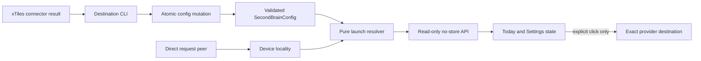

## Context

See `proposal.md` for motivation and the two delta specs for observable behavior.
StudyLoop already separates provider publication behind an exact six-method
`SecondBrain` protocol, while browser navigation has no contract. Configuration
is a single YAML file, but its current whole-file writer can lose concurrent
updates. Web authentication is optional, so a browser configuration mutation
route would be unsafe on a LAN. Today and Settings share no-build static assets,
and release evidence must exercise those assets from an installed wheel.

## Goals / Non-Goals

**Goals:**

- Give launch policy, configuration mutation, and browser navigation one owner
  each, with dependency direction from pure policy toward delivery adapters.
- Keep filesystem and URL validation deterministic and independently testable.
- Preserve the current no-build frontend and lazy CLI architecture while adding
  importable test seams.
- Make package-level verification exercise the same route and assets users run.

**Non-Goals:**

- Redesigning Second Brain publication internals, configuration file format, web
  authentication, or global settings loading.
- Providing distributed locking for non-StudyLoop configuration writers.
- Migrating the static frontend to a framework or adding a build pipeline.
- Generalizing device-locality policy beyond this host-path navigation case.

## Decisions

### Keep launch policy in a pure module

`studyloop.second_brain.launch` owns immutable `LaunchTarget` values and the
provider-neutral resolver. It imports configuration types and standard-library
path/URL utilities only; it does not import provider backends, web code, network
clients, or subprocess facilities. This keeps launchability independent of
publish availability and makes the full truth table testable without I/O beyond
filesystem inspection.

Extending `SecondBrain` or `BrainDescription` was rejected because navigation is
not a publishing capability and would break pinned contracts. Computing provider
rules independently in Today, Settings, and the route was rejected because it
would create three policy owners.

### Use one atomic configuration mutation owner

`studyloop.settings.mutate_raw_config()` becomes the only read-modify-write seam.
It takes an exclusive sibling-file lock, rereads after locking, applies a callback,
validates the complete result through the existing settings resolver, writes a
mode-`0600` sibling temporary file, flushes and syncs it, atomically replaces the
destination, restores the destination mode, and removes temporary state on every
failure. Existing `write_raw_config()` remains compatible by delegating to this
atomic replacement path. `brain enable`, destination set, and destination clear
all use the same owner.

A separate sidecar was rejected because it would duplicate configuration
lifecycle and ownership. Independent command writers were rejected because both
can read stale bytes and silently lose the other update.

### Validate and redact xTiles destinations at the configuration boundary

`SecondBrainConfig` gains one optional destination string. A shared validator
accepts at most 2,048 characters, HTTPS, exact hosts `xtiles.app` and
`app.xtiles.app`, no userinfo, no non-default port, no query or fragment, and a
non-home path. Host comparison uses normalized ASCII output and rejects Unicode
or IDNA-lookalike input. Validation errors use reason categories, never the input
value. The destination command reports only the reviewed host and configured
state.

Query and fragment remain denied. The release gate inspects one real
connector-returned project URL and records only its shape. If either component is
required, the spec, validator, redaction policy, and tests must change together
before release; no runtime exception weakens the allowlist.

### Resolve Obsidian targets by containment and direct locality

For a local browser and an existing absolute vault directory, the resolver prefers
the contained regular `<vault>/<folder>/Today.md`. Missing, non-regular, or
escaping targets fall back to the vault root, which is always rechecked for
containment and existence. Writability is deliberately ignored because opening a
vault is not publishing to it. The final absolute path is encoded with
`urllib.parse.quote(..., safe="")` after target selection.

Only the direct request peer decides locality: loopback is local; a non-loopback
peer is remote; a missing peer is unknown. Forwarding headers are ignored. This
accepts conservative false negatives behind proxies rather than exposing a host
path to a remote browser.

### Expose inert state through a read-only route

A dedicated FastAPI router registered before the static mount serves
`GET /api/second-brain/launch-target` with `Cache-Control: no-store`. Normal
responses serialize `LaunchTarget` exactly. Configuration failures are caught at
this boundary and converted to a generic disabled target; a recognized raw
provider retains its safe label, while an unrecognized provider becomes
`provider=none`, `label=Second Brain`, and `device_locality=unknown`. Invalid
values are never interpolated into response bodies or logs.

No mutation method shares this route. An HTTP writer was rejected because the
existing authentication middleware is conditional and can leave a LAN deployment
without a write barrier.

### Give Today and Settings one shared frontend owner

Today state moves from the legacy `components.js` monolith into an importable
`static/js/components/today-panel.js` module registered by `static/js/main.js`.
This creates an existing-style Node test seam without adding a build step.
Settings remains in its current module. One frontend slice owns both modules and
`index.html` because their state and markup change together.

Today fetches launch state during initialization but never navigates while
fetching. It renders no action for `none`, otherwise one enabled or disabled
selected-provider action. The click handler uses prefetched state so xTiles can
open synchronously in a protected tab; Obsidian assigns the current location to
the custom URI. Settings renders active/muted provider cards and CLI guidance but
never a full retained URL or save control.

### Validate behavior at each boundary and again from a wheel

Unit tests cover validation, atomicity, concurrency, permission preservation,
resolver truth tables, exact URI bytes, and protocol regression. Route tests cover
schema, cache policy, locality, invalid configuration redaction, and absent
mutation methods. Importable JavaScript tests cover state and one-click navigation;
explicitly marked Playwright tests cover Today/Settings rendering and console
cleanliness.

A named installed-wheel smoke builds the wheel, installs `studyloop[web]` into an
isolated environment outside the checkout, starts the installed application,
requests the route, and verifies every launcher asset is served. The smoke is
wired into the repository release gate. Pyright remains the type checker; no new
runtime library is introduced.

## Risks / Trade-offs

- **Reverse-proxy users receive a disabled Obsidian action** → Prefer a safe false
  negative now; design a separately authenticated trusted-locality override later.
- **A real xTiles destination may require query or fragment state** → Keep the
  validator strict until the opt-in connector-shape gate supplies evidence, then
  revise contract and tests before release.
- **Advisory file locks coordinate only cooperating StudyLoop writers** → Keep
  atomic replacement and whole-config validation so external edits are never
  partially written; document that external concurrent writers are unsupported.
- **Vault-root fallback is less specific than Today.md** → It remains a contained,
  useful destination and avoids turning a user-created symlink or directory into
  a launch vector.
- **Invalid configuration is hidden behind a generic web state** → Preserve
  detailed one-line errors in CLI diagnostics while keeping browser responses and
  logs free of untrusted destination values.
- **Extracting Today state can regress legacy startup behavior** → Preserve the
  existing Alpine registration contract and cover initialization plus navigation
  with Node and browser tests before removing the old factory.
- **Installed-wheel web smoke adds release time** → Make it a release-only gate;
  package regressions are otherwise invisible to source-checkout tests.
- **Rollback removes the launcher but leaves an unknown destination key for older
  versions** → The field is optional and provider consent remains unchanged; users
  can clear it before downgrade, and no migration rewrites existing configuration.
